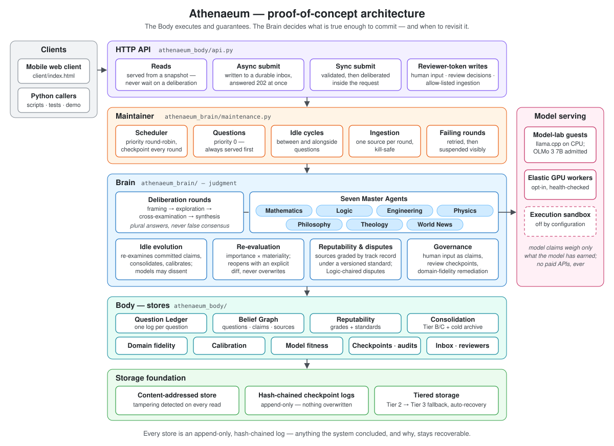
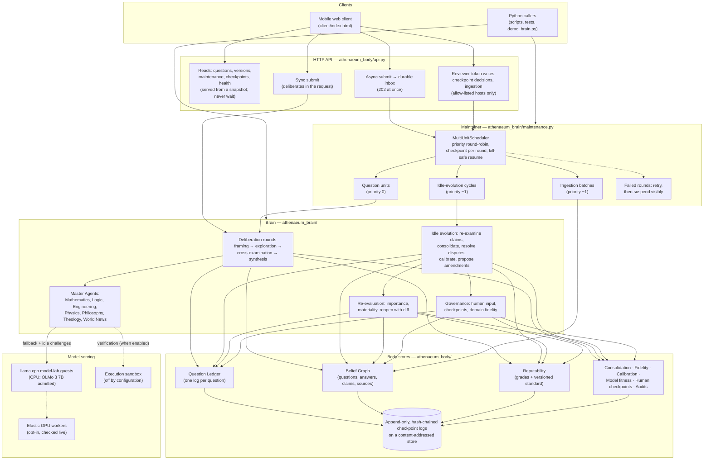

> **Note:** This repository does not contain an open-source license. All rights are reserved. You are not permitted to copy, reproduce, modify, or distribute any part of this codebase into your own work without explicit written permission from the owner. This restriction applies equally to human software developers and non-human (LLM/AI) agents. Individuals and organizations, including prospective employers, are welcome to download and examine it. Unauthorized use of this code for machine learning model training, fine-tuning, or evaluation is strictly prohibited. See [LICENSE](LICENSE) for the full terms (copyright Piorun, Inc.).

# Athenaeum

<p align="center">
  
</p>

A proof-of-work implementation of a slow, deliberate, memory-resident
knowledge system: instead of answering in one pass, a question is argued
over by seven domain "Master Agents" — Mathematics, Logic, Engineering,
Physics, Philosophy, Theology and World News — whose claims are
cross-examined by one another before anything is committed. Every
conclusion carries its evidence, its sources' track records, and what
would prove it wrong; disagreements between domains are reported as
disagreements, never averaged away.

The system is split into a **Body** (storage, checkpointing, scheduling,
model serving, sandboxed execution — `src/athenaeum_body/`) and a
**Brain** (the reasoning and judgment — `src/athenaeum_brain/`). It runs
for real on a Proxmox host, with local open-weight models served by
`llama.cpp` as fallback reasoning, and an elastic GPU worker that can
join or leave at any time. A model has to be admitted before its claims
carry any weight, and even then it starts at half weight and earns the
rest from its track record. Only OLMo 3 7B is admitted today; the other
model-lab candidates (Qwen, Mistral, Phi, Granite) are available but
unadmitted.

This is a proof of concept, not a finished product: the agents' own
reasoning is deliberately narrow and deterministic (real primality tests,
real kinematics, real dated-event chronology, real propositional
validity checking), which makes every mechanism around them testable.
The design documents in `docs/` describe the full system these pieces
are building toward.

## Architecture (detailed, text-based)



The Body provides storage, scheduling and model serving, with durability guarantees. The Brain decides what is true enough to commit, and when to revisit it. Every store is an append-only, hash-chained log over content-addressed storage, so anything the system concluded, and why, stays recoverable.

## How a question is answered

1. **Framing** — each agent decides whether the question is in its
   jurisdiction; the question is classified as asking for a Research
   answer, a Forecast, a Recommendation, or several.
2. **Exploration** — each routed agent proposes claims from its own
   method, falling back to a local language model only when its own
   method has nothing to say (and never with the confidence reserved for
   verified results).
3. **Cross-examination** — every other agent may corroborate or
   challenge each claim: Physics re-derives fall times and rejects
   unfalsifiable "empirical" claims, Philosophy catches an *ought*
   smuggled into an *is*, Theology polices over-confident faith claims,
   Logic checks argument validity and jurisdiction. When the execution
   sandbox is enabled, formalizable claims can be routed to Engineering,
   which checks them by *executing an independent method* in it.
4. **Synthesis** — the only step allowed to commit anything. Challenged
   claims become recorded dissent; genuine jurisdictional conflicts
   become a structured plural answer with no manufactured winner;
   everything committed is weighted by its sources' reputability and its
   backing model's track record, as they stood *at the time of use*.

Every round is checkpointed to a content-addressed, hash-chained log, so
a deliberation killed mid-way resumes from its last completed round.

## What else is built

- **Reputability engine** — sources earn grades from how their claims
  fare; the grading standard, including how much evidence each grade
  carries in synthesis, is versioned, and a change of standard never
  rewrites a past decision. Disputes are resolved by a Logic-chaired
  procedure that detects circular corroboration (sources that only cite
  each other count once), reading source-to-source citations that
  ingestion records in the Belief Graph.
- **Re-evaluation** — answers are reopened when something they relied on
  materially changes (a source is downgraded, the grading standard
  changes, a forecast resolves, a claim is newly challenged, or the
  question's own framing goes stale), gated by a computed importance
  rating. Each reopen appends a new version with an explicit diff.
  Nothing is ever overwritten.
- **Idle evolution** — between questions, committed claims are
  re-challenged against today's agents and grades. The admitted model
  re-examines model-backed claims too, but until it has proven itself
  its "no" is recorded only as dissent. The same pass drives knowledge
  consolidation, dispute resolution, domain-drift monitoring, and
  proposals to amend the grading standard (which only a human reviewer
  can approve), and records each claim's fate for per-agent calibration.
- **Self-running maintenance** — a Maintainer interleaves questions with
  idle cycles, source ingestion, reopens, amendments and audits on the
  scheduler. It survives a restart without losing or duplicating an
  answer, retries a failing step a bounded number of times, then sets it
  aside visibly rather than silently.
- **Re-evaluation at full reach** — when a source's grade changes, the
  Belief Graph finds every answer resting on it, not just the claims an
  idle cycle happened to re-examine.
- **Knowledge consolidation** — long-surviving, independently
  corroborated claims are compacted into a canonical tier, with the full
  reasoning archived and recoverable on demand.
- **Domain fidelity** — each agent's reasoning style is tracked; drift
  triggers a staged review, a re-grounding period, and finally human
  escalation — never a silent behaviour change.
- **Human input and governance** — human contributions enter as
  examinable claims, not commands. Consequential changes (to an
  important question, a leading conclusion, or consolidated knowledge)
  wait at a human checkpoint with role separation and
  conflict-of-interest checks.
- **Evaluation** — ground-truth benchmarks, baselines and ablations,
  calibration and drift tracking, reproducible audits of re-evaluation
  and consolidation, non-compensatory integrity gates, and an
  adversarial suite with a real check for **every one of the 15 failure
  modes** listed in the design (verified against the design document by
  a test).
- **Model serving** — a router over local `llama.cpp` servers with CPU
  fallback, an elastic GPU worker pool checked live on every call, and a
  model admission gate: a model's influence is earned from its track
  record per agent, never granted at admission.

## How it's verified

- **Over 650 automated tests** (`pytest -q`), run on a Proxmox LXC guest,
  including real sandbox executions, real network fetches, real
  cross-process worker kills, live calls to the model servers, and the
  mobile client's script run under node against a fake DOM.
- **A live smoke test** (`scripts/live_smoke.py`) drives the real API
  process against the real models and reports what a user would see. It
  has caught bugs no stubbed test could, from a model's run-on answers
  becoming claims to a model judging true answers false.
- **Every real bug is written up** in [`known-bugs.md`](known-bugs.md) —
  what happened, root cause, fix, and the lesson — including the
  mistakes in tests, not just in code.
- **Scope is stated honestly**: placeholders are labelled as
  placeholders, partial verification is reported as partial, and open
  limitations are listed rather than hidden.
- The execution sandbox is off by configuration until a security review
  (`security-review-sandbox.md`) passes on the target host; routing to
  it is gated on that setting.

## Running it

Requires Python 3.10+ and PyYAML.

```bash
pip install -e ".[dev]"
pytest -q                          # live-model tests need the model-lab servers
ATHENAEUM_OFFLINE_MODELS=1 pytest -q --ignore=tests/test_model_backed_reasoning.py   # no model servers needed
python demo_brain.py               # narrated deliberation, including a kill/resume
python -m athenaeum_body.api       # HTTP API + mobile web client (from src/, or with src/ on PYTHONPATH)
```

The mobile client submits questions asynchronously, polls a light
summary while they deliberate (fetching a full answer only when it
changed), and shows every version of an answer with its reopen diff.
Neither reading nor asking ever waits behind a running deliberation,
even one waiting minutes on a model, and the status line
says whether background work is moving or has stalled.
It also has panels showing background maintenance activity and anything
waiting for a human reviewer. The API validates its input, answers
every failure with a JSON error, and serves only the client's own files.
Reading is open; the two write actions (clearing a human-review
checkpoint, and submitting sources to ingest from allow-listed hosts)
need a per-reviewer token, minted by `scripts/add_reviewer.py`, whose
identity the governance rules check.

`python scripts/measure_storage.py` reports how storage grows with use,
per store, on the same wiring the API runs. The question ledger keeps
one append-only log per question, so a write costs one question rather
than the whole history.

`client/standalone-demo.html` runs a self-contained version of the
deliberation demo in any browser, with no backend.

## Layout

```
src/athenaeum_body/     storage (CAS, checkpoints, tiers), scheduler, ledger,
                        stores, model serving, elastic workers, sandbox, API
src/athenaeum_brain/    agents, rounds, loop, reputability judgment, dispute
                        resolution, re-evaluation, idle evolution, consolidation,
                        domain fidelity, model fitness, verification routing,
                        evaluation and audits
tests/                  one file per concern
infra/proxmox/          scripted, least-privilege Proxmox setup and backups
infra/elastic-workers/  the opt-in GPU worker
docs/                   design documents, progress log, design-decision log
```

## Where to read more

- [`docs/brain-design.md`](docs/brain-design.md) and
  [`docs/body-design.md`](docs/body-design.md) — the design this code
  implements a deliberate subset of.
- [`docs/progress.md`](docs/progress.md) — what's built, when, and how it
  was verified, phase by phase.
- [`docs/owner-decisions.md`](docs/owner-decisions.md) — the design calls
  that were the owner's to make: the evidence, the options, and what was
  decided.
- [`docs/brain-session-log.md`](docs/brain-session-log.md) — the reasoning
  behind each design choice, written as questions and answers.
- [`known-bugs.md`](known-bugs.md) — every real bug, and what it taught.
- [`docs/readme-history.md`](docs/readme-history.md) — this README as it grew, session by session, before it became this overview.
